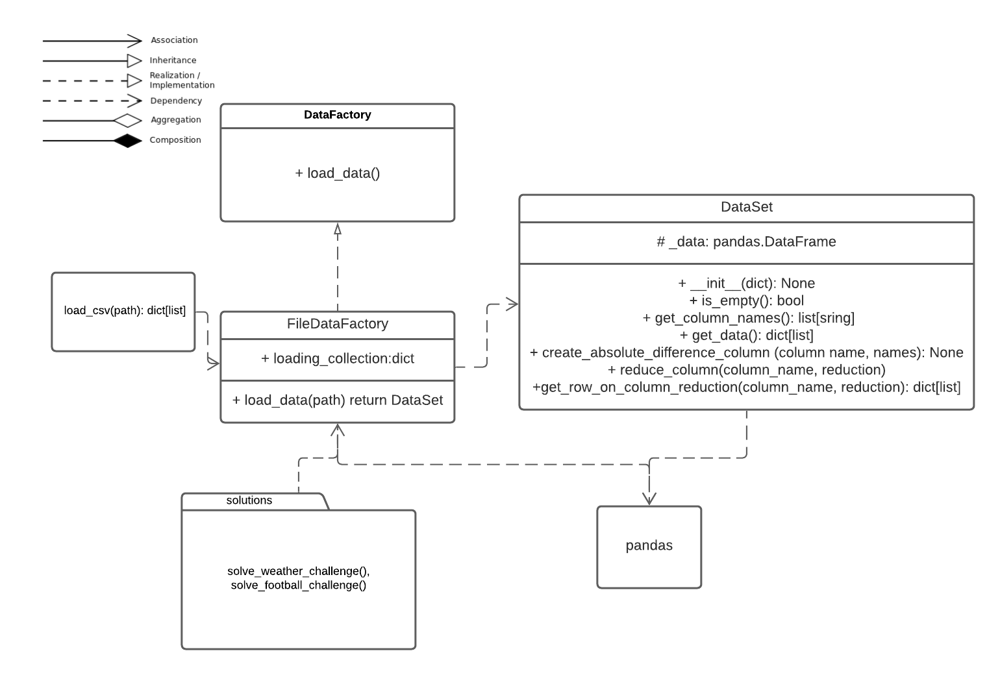

# Problem Analysis
The tasks in question involves loading data in csv format, identifying a datapoint with the minimum difference between given columns and returning a specific value from that row. 

# Approach
## Scratch in Jupyter Notebook (The Data-Scientists Approach)
Initially I will try to solve the problem within jupyter notebooks. 
This allows me to examine the data I load from the csv, compare it to the original file and explore it. I am interested in the following
- Datatypes
- File size (number of columns/rows)
- Null values
- Outliers
- Encoding errors

I will use the pandas package for loading and processing the data. My initial idea is to implement the computations as 
matrix operations and reductions. 
This approach will allow me to familiarize myself with the data and attempt a specific solution.

The scratch_attempt notebook details the solution to the first challenge (weather). The logic is incorporated in 
`solutions/specific/weather_solution.py`.
## Generalize the Problem
The common factors of the football and weather challenges are the file format and most elements of the computation.
The differences are the file names and the data itself.
### The Computation
Let A be a Matrix and i, j indicate column indices. Both tasks follow the form:

MIN(Ai - Aj)

_I would like to keep the concrete reduction function (in this case MIN) flexible_.
## Identify Concerns
The task has a clear separation between **loading** and **processing** the data. Further separations could be made:
- Loading (data from disk to memory)
- Processing 
    - Subtraction (Ai - Aj) 
    - Reduction (MIN)
    - Extraction of the relevant item (i.e. 'Day')
- Optional: Formatting/Printing
## Design Architecture
In order to decouple loading from processing the Architecture will contain an Interface for a DataFactory.
For loading files I will implement a FileDataFactory. This will produce an DataSet object, which will perform the 
computation. Both the DataSet and DataFactory may depend on pandas, but the Implementation must ensure that DataSet will 
be instantiated with parameters, which have no such dependencies. 

## Implementation
I will follow test-driven development (red, green, refactor), but only commit on green and refactor for the sake of overview.
## Evaluation
### robustness & correctness
Using Test-Driven-Development, all classes were checked for correctness during development. However, some tests
have only one condition to check, so extending the conditions would be advised. 
### readability & maintainability
All names were chosen in a manner, which helps readability. Classes names are proper nouns written in _CamelCase_.
All variables and properties are nouns written in _snake_type_. All methods and functions are verb-phrases written in
_snake_type_ also. All methods have docstrings.
As of this point the DataSet object is designed with the specific task in mind. The name may
imply features, which it does not satisfy as of now.
### clean software design & architecture
#### Separation of Concerns
The Implementation separated the two overarching concerns **loading** and **processing** in the DataFactory and 
DataSet classes.
The individual processing steps were separated within different methods of the DataSet class.
#### Coupling
The abstract base class of the DataFactory represents a very simple Interface the Subtypes must implement. 
The FileDataFactory satisfies this in a way, that represents a good basis for loading files in general.
The FileDataFactory and the DataSet both rely on the pandas package. However the DataSet construction is handled in a way,
such that this dependency may be undone in the DataSet class.

For decoupling, as well as being more faithful to the concept of a DataSet, this class should likely build
on an Abstract Base Class with a more extensive set of minimum dataset features.

#### Extendability
The FileDataFactory can be easily extended for further datatypes by adding "Loading functions". This process is still open
to manipulation, which should be addressed in future work. The DataSet may be more
extendable if it had more basic features to build on.

## Final Words
The task in question was a fairly simple one. However, I took it as an opportunity for disciplined adherence to best 
practices and at least a _sketch_ of a data management infrastructure. Given the  limited scope of the project,
the processing element does not have the type of maturity I was looking for. Nonetheless, I hope that 
this project gave some insight in the way I tackle software problems.  
